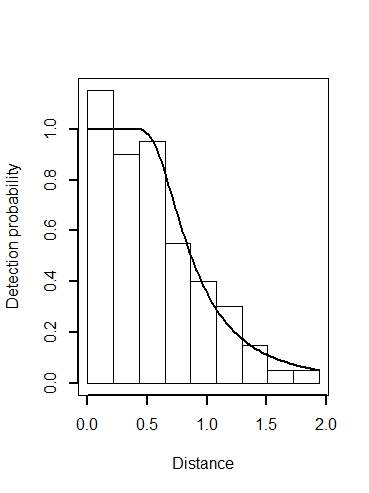

```{r setup, include=FALSE}
library(learnr)
knitr::opts_chunk$set(echo = FALSE)
```


## Topic 1

### Exercise 

Distance sampling is an extension of plot sampling, so there are some similarities between the two.  These questions ask you to compare between the two methods.

```{r plotsamp}
quiz(
  question("What would be the appropriate key function to model data collected using plot sampling?",
    answer("uniform", correct = TRUE),
    answer("half normal"),
    answer("hazard rate"),
    answer("negative exponential")
  ),
  question("Why should there be uncertainty in density estimates generated by plot sampling when there is no detection function to fit?",
    answer("Because only a portion of the study area is sampled; inference must be drawn to portions of the study area not visited.", correct = TRUE),
    answer(""),
    answer(""),
    answer("")
  )
)
```

## Topic 2

### Estimating $\hat{P}_a$

```{r p-sub-a}
quiz(
  question("If a detection function has a small shoulder (or no shoulder at all), what can we say?",
    answer("$\\hat{P}_a$ will be small", correct = TRUE),
    answer("A hazard rate detection function is likely to be suitable"),
    answer("Precision in the estimate of $\\hat{P}_a$ will be poorer than if there is a distinct shoulder", correct = TRUE),
    answer("The area under the fitted detection function curve will be roughly equal to the area under the rectangle")
  ),
  question("Why should there be uncertainty in density estimates generated by plot sampling when there is no detection function to fit?",
    answer("Because only a portion of the study area is sampled; inference must be drawn to portions of the study area not visited.", correct = TRUE),
    answer(""),
    answer(""),
    answer("")
  )
)
```

### Key functions

*You can include any number of single or multiple choice questions as a quiz. Use the `question` function to define a question and the `quiz` function for grouping multiple questions together.*



```{r animage}
  question("What is the key function fitted to these perpendicular distance data?",
    answer("hazard rate", correct=TRUE),
    answer("half normal"),
    answer("uniform"),
    answer("negative exponential")
  )
```

