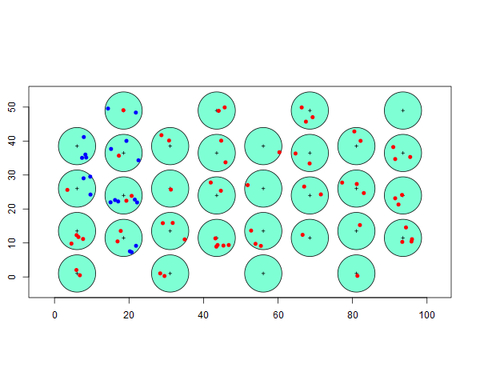

```{r setup, include=FALSE}
library(learnr)
knitr::opts_chunk$set(echo = FALSE)
```

You can skip through questions or sections; you are not required to answer the questions in sequence.  The quiz will remember what questions you have answered, so you can go away from the quiz and return to it, keeping your place.  Should you wish to begin again, and answer the questions a second time, simply press the *Start Over* message.

When the boxes into which you mark your answer are round, there is a single correct answer; however when the boxes are square, there is more than one correct answer.  Click **Submit answer** when you have chosen your answer.  You will receive messages about why your answer was correct or why your answer was not correct.  

***

## Comparison of plot sampling and distance sampling

Distance sampling is an extension of plot sampling, so there are some similarities between the two.  These questions ask you to compare the two methods.  The material under consideration comes from the [first lecture in this chapter](https://workshops.distancesampling.org/online-course/lecturepdfs/Ch1/L1-2 Introduction to Distance Sampling.pdf).

```{r plotsamp}
quiz(caption="Questions about plot sampling",
  question("What would be the appropriate key function to model data collected using plot sampling?",
  correct="Yes, the uniform key function is horizontal--identical (perfect) detection at all distances.", 
	random_answer_order = TRUE,
  answer("uniform", correct = TRUE),
    answer("half normal", 
           message="Probability of detection is constant and perfect at all distances."),
    answer("hazard rate", 
           message="Probability of detection is constant and perfect at all distances."),
    answer("negative exponential", 
           message="Probability of detection is constant and perfect at all distances.")
  ),
  question("Why should there be uncertainty in density estimates generated by plot sampling when there is no detection function to fit?",
  correct="Not all portions of the study area are sampled, so we have uncertainty about number of animals in areas we did not survey.", 
	random_answer_order = TRUE,
  answer("Inference must be drawn to portions of the study area not visited.", correct = TRUE),
    answer("You cannot be certain everything was detected.", 
           message="While this is possible, the magnitude of that uncertainty cannot be quantified."),
    answer("Nature is stochastic, so uncertainty exists in every aspect of population assessment.",
           message="A true statement, but not relevant to this question."),
    answer("There is no uncertainty in estimates derived from plot sampling.",
           message="Incorrect; by the nature of sampling, inference needs to be made about something that is not observed.")
  )
)
```

## Extending plot sampling to distance sampling

These questions are from material [found in this lecture](https://workshops.distancesampling.org/online-course/lecturepdfs/Ch1/L1-2 Introduction to Distance Sampling.pdf).  The topics here relate to the ideas of the *covered region* in distance sampling surveys and the important concept that distance sampling is a two-step process: the first step relies upon a model to make inference about animals not detected in the covered region and the second step relies upon the representativeness of the sampling design to make inference about animals not detected because the survey did not include the area where they reside.

```{r covered-area}
quiz(caption="Some definitions",
  question("What is the *covered region* of a survey?",
  correct="Yes, this region is coloured in aqua in our lecture notes.", 
	random_answer_order = TRUE,
    answer("Portion of study region within truncation distance *w* of any line or point transect.", correct=TRUE),
	answer("Portion of study area with vegetation cover.", 
	  message="Sorry, nothing to do with vegetation."),
	answer("observers seek cover in some portions of the study area.", 
	  message="This is a nonsensical answer."),
	answer("Part of the study area on the shoulder of the detection function.", 
	  message="Animals can be detected beyond the shoulder, but with lower probability."),
	answer("Portion of study area where animals can be detected", correct=TRUE)
	),
  question("What are the two steps to abundance estimation using distance sampling surveys?",
    correct="Yes, first a detection function *model* is used to determine animals missed in the covered region. From that estimate of density, that density estimate is extrapolated to the full study area.", 
	random_answer_order = TRUE,
    answer("Estimation of animals in covered region, then extrapolation from covered region to study area.", correct=TRUE),
    answer("Extrapolation from covered region to study area, then estimation of animals in covered region.",
      message="You have reversed the order."),
    answer("Census animals in covered region, extrapolation from covered region to study area.", 
	    message="This is the definition of plot sampling."),	
    answer("Census animals in covered region, covered region equal to study area.", 
	    message="This survey has no sampling involved, every animal is counted.")
    )
)
```


## Estimating probability of detection

You are introduced to several key functions defining detection functions in the chapter entitled [*Choosing a detection function*](https://workshops.distancesampling.org/online-course/lecturepdfs/Ch1/L1-4 Choosing a Detection Function.pdf).  Please think about the consequences of the shape of detection functions upon your inference about population density as you answer these questions.

### Estimating $\hat{P}_a$

```{r p-sub-a}
quiz(caption="Estimating probability of detecting animals within truncation distance of transects",
  question("If a detection function has a small shoulder (or no shoulder at all), what can we say?",
    answer("$\\hat{P}_a$ will be small", correct = TRUE),
    answer("A hazard rate detection function is likely to be suitable",
           message="Hazard rate **has** a shoulder, so is unlikely to be suitable."),
    answer("Precision in the estimate of $\\hat{P}_a$ will be poorer than if there is a distinct shoulder", correct = TRUE,
           message="With the detection function roughly horizontal at small distances, parameter(s) of the detection function can be estimated with greater precision."),
    answer("The area under the fitted detection function curve will be roughly equal to the area under the rectangle",
           message="A [sharply declining detection function](https://workshops.distancesampling.org/online-course/syllabus/Chapter7/#multi-species-survey---montrave-line-transects) will have a small area relative to the area under the rectangle.")
  ),
  question("Why should there be uncertainty in density estimates generated by plot sampling when there is no detection function to fit?",
    answer("Because only a portion of the study area is sampled; inference must be drawn to portions of the study area not visited.", correct = TRUE),
    answer("There is uncertainty about the true detection function", 
           message="By assumption, all animals are detected, so there is no detection function."),
    answer("The survey provides no information about the segment of the animal population away from the surveyed transects", 
           message="This is partially true.  By assumption distance sampling assumes that transects are placed randomly so that data collected on transects is relevant to portions of the study area not sampled."),
    answer("Variability in encounter rates between transects makes us uncertain about the encounter rate on a transect located elsewhere on the study area",
           correct=TRUE)
  )
)
```

### Key functions

Provided the detection fitted to data at right, answer the following question.  


```{r animage}
  question("What is the key function fitted to these perpendicular distance data?",
    answer("hazard rate", correct=TRUE),
    answer("half normal", 
           message="Note the existence of a shoulder on the function; half normal has a gradual decline even at small perpendicular distances."),
    answer("uniform",
           message="Seriously?  A uniform key function does not diminish at all."),
    answer("negative exponential",
           message="Negative exponential has **no** shoulder and drops away rapidly at small perpendicular distances.")
  )
```


## Calculation of abundance when information is available for some undetected animals

The diagram below shows the result of a point transect survey.  The detected animals are indicated as red dots.  For the western-most two rows of point transects, we are given information of not only the animals detected, but also the animals within the detection range, but undetected, are shown in blue. This is not the usual situation, but we include it so you can see how calculations are performed.

Ordinarily, we would fit a detection function to sighting data to produce our estimate of $\hat{P_a}$, but here we employ some *magic* providing us with information about animals we do not detect on a few transects.

- The detection radius for each point is 5 units, 
- there are 32 sampling points and
- size of rectangular study area is 5000 units



<!--
```
 n 62 
 undetected 78 
 detected two rows 13 
 undetect two rows 20 
 Pa 2 rows 0.3939394 
 Pa 0.4428571 
 Nc 140 
 a 2513.274 
 A 5000 
 Nhat 278.5212 
 detfn Nhat 314.6672
``` 
-->

```{r pointran}
quiz(caption="Answer the following questions based upon the information given above",
  question("How large is the covered region?",
	random_answer_order = TRUE,
	correct="Each point transect has area of $\\pi r^2 = \\pi \\cdot 5^2 = 78.54$, there are 32 of these.",
    answer("2513.3", correct=TRUE),
    answer("5000", 
           message="No, that is the size of the study area."),
    answer("0.503", 
           message="No, this is the fraction of the study area covered by survey effort (2513/5000)."),
    answer("502.65", 
           message="No, you've forgotten to square the radius of each point transect.")
  ),
  question("Based upon the information from the first two rows of point transects, what is $\\hat{P_a}$?",
	random_answer_order = TRUE,
	correct="There were 13 detected animals on the west-most 8 transects and 20 undetected animals on those transects.  13/(13+20)=0.394",
    answer("0.394", correct=TRUE),
    answer("0.650", 
           message="No, 13/20 is not the proportion detected of animals on the plots."),
    answer("0.606", 
           message="No, 20/33 is probability of *not* detecting animals on the plots."),
    answer("0.130", 
           message="No, there were 13 detected animals on the west-most 8 transects and 20 undetected animals on those transects.")
  ),
  question("Assuming $\\hat{P_a}$ is the same for the remaining point transects, estimate the abundance of animals in the covered region.",
	random_answer_order = TRUE,
	correct="Counting red dots, there are 62.  $62 / 0.3939 = 157$.",
    answer("157", correct=TRUE),
    answer("102", 
           message="No this would be $62 / 0.606$ rather than $62 / 0.3939$ "),
    answer("140", 
           message="Perhaps you miscounted the number of red dots."),
    answer("152", 
           message="Perhaps you miscounted the number of red dots.")
  ),
  question("Given the estimate of abundance in the covered region, estimate the abundance over the entire study area.",
	random_answer_order = TRUE,
	correct = "Because this is a simulation, we know the true N is 280, your estimate should be 157 / 0.502.",
    answer("312", correct=TRUE),
    answer("157", 
           message="No, this is estimated number of animals in covered region, $\\hat{N_c}$"),
    answer("315", 
           message="No, this would be the result if you had the ratio of covered region to study area reversed."),
    answer("62", 
           message="No, this would be the result if detection probability was perfect and the covered region was equal to the study area size.")
  )
)	
```

## Calculations of density and abundance

To confirm computations made by program Distance, below are components from a line transect distance sampling survey and analysis needed to produce a density estimate.  Use these components to answer the following questions, along with these formulas from [slide 7 of lecture in Chapter 1.](https://workshops.distancesampling.org/online-course/lecturepdfs/Ch1/L1-5%20Three%20More%20Ways.pdf)

$$
\hat{D} = \frac{n}{2wL \hat{P}_a} \hspace{2cm} \hat{N} = \frac{nA}{2wL \hat{P}_a}
$$

```{r minkenorth, message=FALSE, results='hide'}
library(Distance)
data(minke)
out <- summary(ds(minke[minke$Region.Label=="North",]))
knitr::kable(out$dht$individuals$summary[2:7])
```

|   Area| CoveredArea|  Effort|  n|  k|Encounter Rate|
|------:|-----------:|-------:|--:|--:|-------------:|
| 630582|    5270.514| 1358.38| 51| 12|     0.0375447|

The truncation distance ($w$) for the survey was `r round(out$ds$width, 2)`. In this situation, we have fitted a detection function to the sighting data and we have estimated the probability of detection of animals within the covered area $(\hat{P}_a)$ to be `r round(out$dht$individuals$average.p,4)`.


```{r calculate}
quiz(caption="Perform calculations by hand to duplicate results produced by Distance software",
  question("What is the estimated density of animals based upon this summary information?",
    correct="Apply the density formula shown above to produce this density estimate.",
	  random_answer_order = TRUE, 
    answer("11282", 
           message="This is the estimate of abundance."),
    answer("0.0179", correct = TRUE),
    answer("0.1789", 
           message="Off by one order of magnitude."),
    answer("1128", 
           message="Abundance estimate off by an order of magnitude.")
  ),
  question("What is the estimated *abundance* of animals in the study area?",
  correct="Note only a small fraction of the study area is surveyed, so estimate is likely to be quite large.",
	random_answer_order = TRUE,
    answer("11282", correct = TRUE),
    answer("0.0179", 
           message="This is the density rather than abundance estimate"),
    answer("0.1789", 
           message="Density estimate off by one order of magnitude."),
    answer("1128", 
           message="Abundance estimate off by an order of magnitude.")
  )
)
```


## Issues regarding detection functions and truncation

Detection functions should possess certain properties; think about those properties when answering the first question.  Also discussed in this lecture is the subject of truncating data before fitting detection functions.  Contemplate the reason behind truncation in your answer to that question.

```{r robust}
quiz(caption="Questions related to lecture entitled *Choosing a detection function* of Chapter 1",
	question("Why is the hazard rate model more *model robust* than the half-normal model?",
    answer("Hazard rate model has two parameters rather than one, making it more flexible.", 
      correct=TRUE),
    answer("Hazard rate model can resist violations of distance sampling assumptions.", 
	    message="No, neither model is resistant to violation of method assumptions."),
    answer("Actually, the half-normal model is more model robust than the hazard rate model.", 
	    message="No, the question is stated correctly."),
    answer("Hazard rate model has a more distinct *shoulder*", 
	    message="Shoulder relates to the shape criterion of a good model, rather than the criterion of model robustness."),
  correct="Know both definition of *model robust* and which model possesses that characteristic.",
	random_answer_order = TRUE  
),
  question("Detections at large distances are often truncated from the data set prior to analysis.  Why?",
    answer("shape of detection function (or probability density function) is most critical at small distances", 
      correct=TRUE),
    answer("difficult to determine the sex of animals at great distances", 
	    message="While a true statement, not relevant for density estimation."),
    answer("too many detections may overload the computer software", 
	    message="Distance sampling software is capable of analysing very large data sets, this is not a problem."),
    answer("detections at large distances violate the assumption of strip transects", 
	    message="Statement is both false and irrelevant."),
    correct="Recall that the parameter *f(0)* is estimated; it is the value the probability density function takes on at distance 0.  Detections at large distances contain little information about *f(0)*.",
  	random_answer_order = TRUE
	)
)	
```

## The probability density function

The concept of a detection function is intuitive.  However, the concept of a probability density function is more opaque.  This set of questions gives you the opportunity to compare and contrast detection functions and probability density functions.

```{r pdf}
quiz(caption="Probability density function used for estimating density",
  question("What does the probability density function represent?",
    correct="Given an animal is within the truncation distance, what is the probability it was detected within a small interval of distances from the transect.",
	random_answer_order = TRUE,
    answer("Distribution of observed detection distances", correct=TRUE),
    answer("Probability of detecting animal given it is at distance *x*", 
	    message="Sorry, that is the definition of the detection function *g(x)*."),
    answer("Distribution of animals at various distances from the transect", 
	    message="The distribution of animals is not observed, it is assumed."),
    answer("Probability that animal density is a given value", 
	    message="Unfortunately, the word *density* in probability density function has nothing to do with animal density that is being estimated by distance sampling.")
  ),
  question("How does the probability density function described above differ from a detection function?",
    correct="Detection function does not take into account how animals distribute themselves with respect to the transect.  Detection function only considers the detection process, not the animal distribution process.",
	random_answer_order = TRUE,	
    answer("The conditional part of the probability with the PDF is given the detection was somewhere within the detection region (within distance *w* of the transect)", correct=TRUE),
    answer("Probability of detecting an animal given it was at distance *x* of the transect", 
	    message="This is the definition of a detection function."),
    answer("There is no difference, they are the same", 
	    message="No, the difference is in the conditional part of the probability statement."),
    answer("A detection function is always larger than a probability density function", 
	    message="Such a generalisation about the magnitude of the two functions cannot be drawn.")
	),
  question("Two processes give rise to detection of animals within the truncation distance; identify the two processes.",
    correct="One process deals with how the animals are distributed, the other deals with how the observers perceive the animals.",
	random_answer_order = TRUE,	
    answer("Distribution of animals with respect to the transect", correct=TRUE),
    answer("Probability of detecting an animal as a function of distance from transect", correct=TRUE),
    answer("Distribution of survey effort with respect to time of day", 
	    message="While this might affect animal distribution, if transects are placed at random in sufficient numbers, this should not affect distribution of detections."),
    answer("Possibility of laser rangefinder malfunction", 
	    message="Unrelated to either the distribution of animals or the detection process.")
	)
)
```