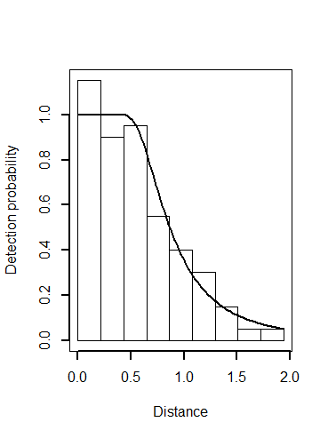

```{r setup, include=FALSE}
library(learnr)
knitr::opts_chunk$set(echo = FALSE)
```


## Comparison of plot sampling and distance sampling

#### Just testing

Watch this video and answer the following questions

{width=80%}

### Your understanding of plot sampling 

Distance sampling is an extension of plot sampling, so there are some similarities between the two.  These questions ask you to compare between the two methods.

```{r plotsamp}
quiz(caption="Questions about plot sampling",
  question("What would be the appropriate key function to model data collected using plot sampling?",
    answer("uniform", correct = TRUE),
    answer("half normal"),
    answer("hazard rate"),
    answer("negative exponential")
  ),
  question("Why should there be uncertainty in density estimates generated by plot sampling when there is no detection function to fit?",
    answer("Because only a portion of the study area is sampled; inference must be drawn to portions of the study area not visited.", correct = TRUE),
    answer(""),
    answer(""),
    answer("")
  )
)
```

## Estimating probability of detection

### Estimating $\hat{P}_a$

```{r p-sub-a}
quiz(caption="Estimating probability of detecting animals within truncation distance of transects",
  question("If a detection function has a small shoulder (or no shoulder at all), what can we say?",
    answer("$\\hat{P}_a$ will be small", correct = TRUE),
    answer("A hazard rate detection function is likely to be suitable",
           message="Hazard rate **has** a shoulder, so is unlikely to be suitable."),
    answer("Precision in the estimate of $\\hat{P}_a$ will be poorer than if there is a distinct shoulder", correct = TRUE,
           message="With the detection function roughly horizontal at small distances, parameter(s) of the detection function can be estimated with greater precision."),
    answer("The area under the fitted detection function curve will be roughly equal to the area under the rectangle",
           message="A [sharply declining detection function](https://workshops.distancesampling.org/online-course/syllabus/Chapter7/#multi-species-survey---montrave-line-transects) will have a small area relative to the area under the rectangle.")
  ),
  question("Why should there be uncertainty in density estimates generated by plot sampling when there is no detection function to fit?",
    answer("Because only a portion of the study area is sampled; inference must be drawn to portions of the study area not visited.", correct = TRUE),
    answer("There is uncertainty about the true detection function", 
           message="By assumption, all animals are detected, so there is no detection function."),
    answer("The survey provides no information about the segment of the animal population away from the surveyed transects", 
           message="This is partially true.  By assumption distance sampling assumes that transects are placed randomly so that data collected on transects is relevant to portions of the study area not sampled."),
    answer("Variability in encounter rates between transects makes us uncertain about the encounter rate on a transect located elsewhere on the study area",
           correct=TRUE)
  )
)
```

### Key functions

You can include any number of single or multiple choice questions as a quiz. Use the `question` function to define a question and the `quiz` function for grouping multiple questions together.  



```{r animage}
#quiz(caption="Examine the data and detection function at right for these questions.",
  question("What is the key function fitted to these perpendicular distance data?",
    answer("hazard rate", correct=TRUE),
    answer("half normal"),
    answer("uniform"),
    answer("negative exponential")
  ) #,
  question("Can you determine if there were adjustments included in detection function; if so how many?",
    answer("0", correct=TRUE),
    answer("1"),
    answer("2"),
    answer("cannot determine")
  )
#)
```

