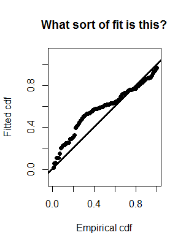

```{r setup, include=FALSE}
library(learnr)
knitr::opts_chunk$set(echo = FALSE)
```

You can skip through questions or sections; you are not required to answer the questions in sequence.  The quiz will remember what questions you have answered, so you can go away from the quiz and return to it, keeping your place.  Should you wish to begin again, and answer the questions a second time, simply press the *Start Over* message.

When the boxes into which you mark your answer are round, there is a single correct answer; however when the boxes are square, there is more than one correct answer.  Click **Submit answer** when you have chosen your answer.  You will receive messages about why your answer was correct or why your answer was not correct.  

***




```{r qq}
quiz(caption="Quantile-quantile or QQ plots to assess model fit",
	question("Why can QQ plots not be produced with binned distances?",
	  correct="There are usually too few bins to make a reasonable assessment of fit",
	  random_answer_order = TRUE,
	  answer("There will only be as many points in the plot as distance bins", correct=TRUE),
	  answer("Graphics cannot support plotting such data", message="Nothing to do with software"),
	  answer("The 45 degree line does not exist", message="This line is defined regardless of number of data points"),
	  answer("Goodness of fit cannot be assessed for binned data", message="Fit can be assessed, but number of points of support will be small and uninformative")
	  )
	  
	question("What is the necessary magnitude of departures from the 45 degree line before concern about model fit?",
	  correct="Visual inspection of the QQ plot is not sufficient to determine fit; departures are turned into number by tests",
	  random_answer_order = TRUE,
	  answer("Computed via Kolomogorov-Smirnov or Cramer von Mises tests", correct=TRUE),
	  answer("Slope of the line fit through the points is less than 45 degrees", message="A line is not fitted to the points of a QQ plot"),
	  answer("If more than half the dots fall below the 45 degree line", message="Proportion of dots above/below line is not informative about fit"),
	  answer("Any points not falling on the line indicate lack of fit", message="Not all points need to be on the 45 degree line for fit to be adequate")
	  )  
	  
	question("What does the 45 degree line represent?",
	  correct="",
	  random_answer_order = TRUE,
	  answer("Equality of rate at which empirical (data) and theoretical (model) distributions are traversed", correct=TRUE),
	  answer("", message=""),
	  answer("", message=""),
	  answer("", message="")
	  )  

	question("What problem in data collection is depicted by this pattern in a QQ plot?",
	  correct="Fitted exceeds empirical (data) at small distances, then empirical catches up to fitted",
	  random_answer_order = TRUE,
	  answer("Too few detections near the line; perhaps animals are moving away before detection", correct=TRUE),
	  answer("There is no problem, this is a good fit of detection function to data", message="Actually this is a very poor fit"),
	  answer("Heaping of distances to 0 distance", message="If this was the case, the dots would be below the line on the left side of the plot"),
	  answer("Animals are being missed on the transect", message="Nothing in the collected data informs us whether animals are being missed on the trackline")
	  )  
)